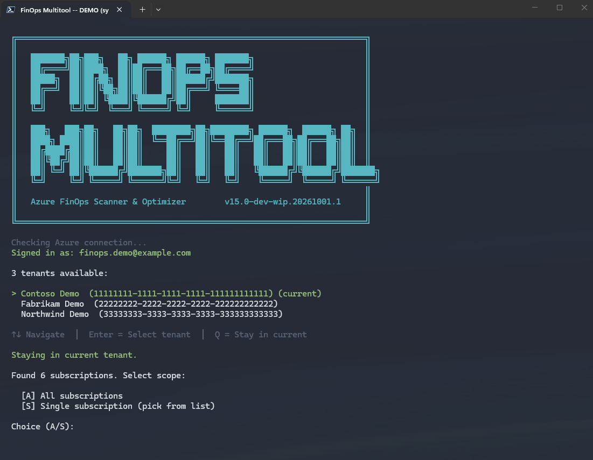
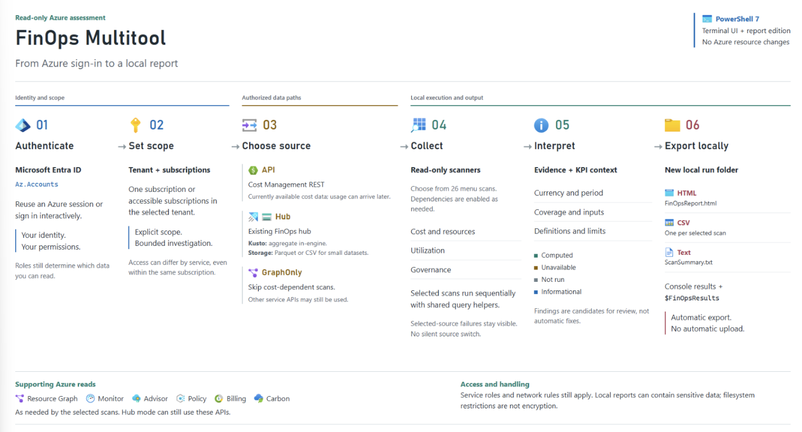
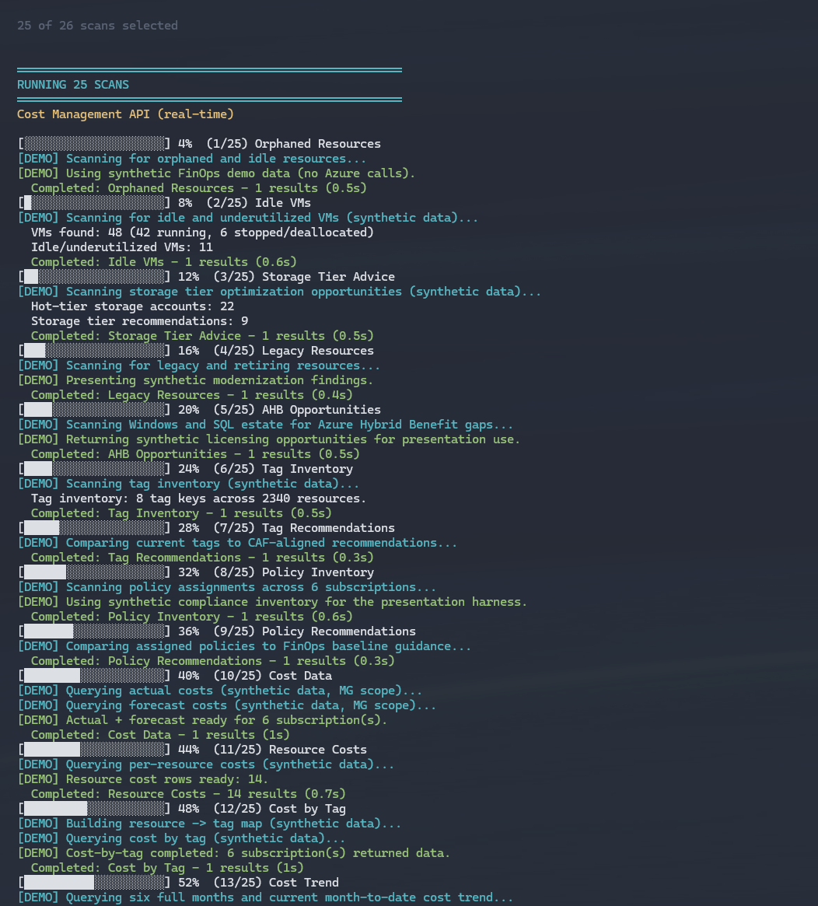

<!-- markdownlint-disable -->
# FinOps Multitool TUI

An **unofficial, standalone preview snapshot** of the FinOps Multitool terminal
UI. Download it to run interactive FinOps scans against Azure subscriptions.
This is not an official Microsoft release or the older WPF Multitool.

The runtime uses the **v15.0-dev-wip.20261001.1** version label. Preview status does not
imply production support or complete live-data validation. This repository
contains a clean source snapshot, not previous private development history or
test release archives.

Use the TUI for a scoped assessment that brings cost drivers, resource
inventory, and optimization findings into a local report. It complements
ongoing reporting in Cost Management, Power BI, and FinOps hubs; it doesn't
replace their ingestion pipelines or monitor the environment between runs.

- [Choose your cost data source](#choose-your-cost-data-source)
- [Run a scan from start to finish](#run-a-scan-from-start-to-finish)
- [Review and share the results](#review-and-share-the-results)
- [Use the Multitool with Fabric](#use-the-multitool-with-fabric)

## Startup screen



## Workflow



## Download

- [Download the source ZIP](https://github.com/z-larsen/FinOps-Multitool-TUI/archive/refs/heads/main.zip)
  and extract it into a **new folder**. GitHub normally names that folder
  `FinOps-Multitool-TUI-main`.
- Alternatively, clone `https://github.com/z-larsen/FinOps-Multitool-TUI.git`.

No GitHub account is required to download the public source. Keep `Public`,
`Private`, and `en-US` together with the root files; do not copy just the public
entry-point script.

## Prerequisites

- **PowerShell 7** (`pwsh`), not Windows PowerShell 5.1. The separate Azure Tool
  Launcher requires **PowerShell 7.4+**.
- PowerShell modules **Az.Accounts**, **Az.ResourceGraph**, and **Az.Storage**,
  installed in the PowerShell 7 environment.
- Azure sign-in and appropriate access to the scope being scanned. Reader is a
  starting point; billing, cost, storage export, and hub data can require
  additional permissions. See the
  [Multitool documentation](Private/FinOpsMultitool/README.md) for details.
- Network access to Azure and any data-source/dependency endpoints used by your
  selections. This is not an offline scanner.

Windows is the documented launch path for this distribution. Native Linux and
macOS operation has not been verified for this public snapshot.

## Start the TUI

Open a fresh PowerShell 7 terminal in the extracted folder. After reviewing and
trusting the downloaded code, unblock the PowerShell files if Windows marked
them as downloaded:

```powershell
Get-ChildItem -LiteralPath . -Recurse -File |
    Where-Object Extension -in '.ps1', '.psm1', '.psd1' |
    Unblock-File
```

Load the public entry point, then call the function:

```powershell
$ErrorActionPreference = 'Stop'
. .\Public\Start-FinOpsMultitool.ps1
Start-FinOpsMultitool
```

Running the public file with `-File` alone only defines the function; it does
**not** open the TUI. Interactive startup handles authentication and lets you
select subscriptions, data sources, and scans. Numbered prompts are used when
the terminal cannot support arrow-key menus.

For an unattended run, authenticate separately with the intended Azure identity
first, then use `-NonInteractive` and explicit scope/scan parameters. Do not
assume the current Azure context belongs to the intended tenant.

An explicit `-SubscriptionId` must resolve in that tenant. The tool stops on an
unresolved or mismatched subscription instead of searching other tenants or
widening the scan. To target another tenant, sign in to it first. A valid
subscription selection changes context only in the current PowerShell process.

The root `FinOpsToolkit.psm1` loader is also included for compatibility. Importing
it exports the additional commands packaged in this snapshot, including
commands unrelated to the TUI. The direct entry-point instructions above avoid
importing that broader command surface. Only the Multitool scan modules are
described as read-only; this is not a blanket statement about every packaged
command.

## Choose your cost data source

The data source controls where supported cost scans read their data. It doesn't
replace Azure sign-in or the permissions needed by other scans.

| Your starting point | Path in this TUI | What to expect |
| --- | --- | --- |
| FinOps hub with Azure Data Explorer or a compatible Microsoft Fabric KQL database | **FinOps Hub**, with the query endpoint and database configured when needed | Cost queries aggregate in the database and return summaries to PowerShell. |
| Recognized FinOps hub with storage only | **FinOps Hub**, using the storage reader when no Kusto provider is selected | Reads supported Hub Parquet or CSV data into local memory. Use this path for small datasets. |
| Regular Cost Management CSV/CSV.gz export in Azure Storage | **Cost Management exports (CSV storage)** or `-DataSource Export` | Discovers selected-scope definitions and export-like storage containers. Reads one chosen export, filters row subscriptions, and labels partial coverage. No Hub required. |
| Parquet exports or downloaded local files | Not supported by the ordinary CSV export source | Use a compatible FinOps hub for Parquet. `-OutputPath` is a report destination, not an input-file parameter. |
| No hub, or you want to query Cost Management directly | **Cost Management API** or `-DataSource API` | Uses the Cost Management APIs for cost scans. Costs can lag usage, and API throttling can extend the run. |

`-DataSource` accepts `Hub`, `Export`, `API`, and `GraphOnly`. `GraphOnly` excludes
cost-dependent scans, but remaining scans can still call services such as
Azure Monitor, Advisor, and Azure Policy. `Export` reads ActualCost or FOCUS
BilledCost CSV data for cost totals, resource costs, cost by tag, and the months
present in the selected run. Separate financial API scans are excluded, while
inventory scans can still query Azure. Export failures never switch to live costs.
There is no local input-file parameter; `-OutputPath` sets the report destination.

To skip Hub detection and look for ordinary exports directly, run
`Start-FinOpsMultitool -DataSource Export`. Keep the intended tenant and subscriptions
selected. Choose an export from the displayed destinations; unattended mode requires
exactly one candidate. Storage Blob Data Reader or equivalent data access and a
permitted network path are required. The picker discovers subscription exports,
exports at management-group ancestors, and exports at linked billing accounts.
It also discovers likely storage destinations automatically; you don't need to know
a container name. Container metadata is checked before blob-service enumeration,
and unavailable locations produce a summary rather than a warning flood. Use
`-Verbose` for details. CSV parts are loaded into memory; use Kusto for very large datasets.

Automatic Hub discovery stays within the selected tenant and subscriptions.
If a Hub can't be verified because discovery probes fail, the tool warns and
continues to the API/GraphOnly menu, or defaults to API with `-NonInteractive`.
This also applies when every probe fails. An explicit `-DataSource Hub` never
switches to API automatically. Explicit API and GraphOnly choices skip Hub discovery.

Provider-discovery exceptions for a detected Hub warn and allow its storage
reader to be considered, with the existing size and reachability warnings.
The scan runner keeps the selected storage path without rediscovering a provider.
Explicit Kusto endpoints and failed Kusto cost queries never silently switch sources.

## Run a scan from start to finish

Prepare the session once, follow the path for your data source, and finish with
[Review and share the results](#review-and-share-the-results). These examples
use one subscription so you can check access and data coverage before expanding
the scope. They don't create a hub, configure an export, or change Azure resources.



### Prepare your session

1. Complete the [prerequisites](#prerequisites) and open PowerShell 7 in the
    extracted folder. Replace both placeholders with your intended scope.

    ```powershell
    $ErrorActionPreference = 'Stop'
    $tenantId = '<tenant-id>'
    $subscriptionId = '<subscription-id>'
    . .\Public\Start-FinOpsMultitool.ps1
    Connect-AzAccount -Tenant $tenantId -Subscription $subscriptionId
    ```

2. Confirm the signed-in account, tenant, and subscription before continuing.
    Azure permissions and data-source permissions are separate: subscription
    Reader access doesn't grant access to Hub storage or a KQL database.

    ```powershell
    Get-AzContext | Select-Object Account, Tenant, Subscription
    ```

3. Start with a small set of scans. This example combines cost summaries and
    allocation data with resource tags and VM activity.

    ```powershell
    $scanNames = @(
        'Get-CostData',
        'Get-ResourceCosts',
        'Get-TagInventory',
        'Get-CostByTag',
        'Get-IdleVMs'
    )
    ```

The commands below preselect these scans. Review the selection in the menu,
then press Enter to run it. Required dependencies can be added automatically.
For a repeatable run without prompts, add `-NonInteractive` after you've
verified the source and scope. That mode requires an existing Azure session.

### Read a hub in Fabric or Azure Data Explorer

Use this path when a FinOps hub already ingests costs into Azure Data Explorer
(ADX) or a Microsoft Fabric Eventhouse KQL database.

1. Ask the hub owner for the HTTPS query endpoint, database name, and permission
    to query the data. Use database Viewer or equivalent data-read access,
    including any dependent databases. Confirm the endpoint is reachable from
    your machine through the approved network path.
2. Confirm that ingestion has completed for the subscriptions you plan to scan.
    The selected database must expose the FinOps hubs `Costs` function and the
    fields this snapshot queries: `BilledCost`, `BillingCurrency`,
    `ChargePeriodStart`, `SubAccountId`, `SubAccountName`, `ResourceId`,
    `ResourceType`, `x_ResourceGroupName`, and `Tags`. An arbitrary cost table
    isn't automatically compatible. See the
    [Kusto provider](Private/FinOpsMultitool/modules/helpers/Get-FOHubProvider.ps1)
    for the query contract.
3. For Fabric, open the KQL database and copy **Query URI** from **Database
    details**. Don't use the ingestion URI, a workspace sharing link, or a SQL
    endpoint. See [Access an existing KQL database](https://learn.microsoft.com/fabric/real-time-intelligence/access-database-copy-uri).
    For ADX, use the cluster's query URI. Configure Fabric explicitly: automatic
    discovery in this snapshot searches Azure Resource Graph for tagged ADX
    clusters, not Fabric workspaces.
4. In the same PowerShell session, replace the endpoint placeholder and set the
    database name. `Hub` is the default; use the database that exposes `Costs`,
    not the raw `Ingestion` database.

    ```powershell
    $env:FINOPS_HUB_KUSTO_URI = 'https://<your-query-host>'
    $env:FINOPS_HUB_KUSTO_DB = 'Hub'
    Start-FinOpsMultitool -SubscriptionId $subscriptionId -DataSource Hub -Scans $scanNames
    ```

5. Confirm that the console shows **Querying FinOps Hub Kusto database** and the
    intended endpoint and database. After the run, open the generated report and
    check the selected scope, cost period, and scan status.

**Expected result:** Cost Data, Resource Costs, and Cost by Tag use summaries
calculated in Kusto. The raw cost dataset isn't downloaded into PowerShell.
These summaries use `BilledCost` and a window anchored to the latest month in
the database, so check dates rather than assuming the results cover today.
Resource results are limited to the top 500 rows returned by this query path.

Other scans can still call live Azure APIs. The Kusto cost summary doesn't
include a forecast, and the AI Workload Metrics scan isn't supported on this
Kusto path. Use a separate API run when you need those results. A query failure
against the selected Kusto endpoint is reported as a failure, not silently
replaced with API costs.

### Read a storage-only FinOps hub

Use this path for small datasets in an existing FinOps hub that doesn't have a
selected Kusto provider.

1. Confirm Storage Blob Data Reader or equivalent access to the Hub data, along
    with network access to its storage endpoints. The TUI discovers Hub storage
    only in the selected subscriptions. This single-subscription example needs
    the Hub storage account to be discoverable in that subscription.
2. Clear any Kusto override from this PowerShell session, then start a Hub run.

    ```powershell
    Remove-Item Env:\FINOPS_HUB_KUSTO_URI, Env:\FINOPS_HUB_KUSTO_DB -ErrorAction SilentlyContinue
    Start-FinOpsMultitool -SubscriptionId $subscriptionId -DataSource Hub -Scans $scanNames
    ```

3. Check the source shown in the console. **Loading cost data from FinOps Hub
    storage (small-dataset reader)** identifies the storage path. `Hub` doesn't
    force storage: a discovered Kusto provider takes precedence. If no Hub is
    found, stop and check the selected scope; don't broaden a customer scan just
    to locate a storage account. Use an explicit Kusto endpoint or an API run
    when appropriate.
4. Review the file-read messages and resulting cost period. The reader looks
    for current-month Parquet data under `ingestion/Costs/yyyy/MM`. When that
    data isn't available, it can read uncompressed CSV files from the Hub's
    `msexports` container, selecting the newest populated billing period. The
    [storage reader](Private/FinOpsMultitool/modules/helpers/Read-FinOpsHubData.ps1)
    has specific format and folder expectations; it isn't a general file importer.
5. After report generation, review scan status and compare the cost dates and
    currency with the source exports before sharing the report.

**Expected result:** Supported cost scans reuse the Hub rows, aggregated locally.
This path downloads files and loads rows into memory. For large datasets, use
Fabric or ADX to aggregate in the database. Parquet reads also need the verified
reader dependencies; missing dependencies or failed reads require investigation.
For current-month storage data, the tool can request a separate full-month
forecast from Cost Management when access and matching currency allow it.

### Start with a regular Cost Management export

An export in an ordinary storage container, or a downloaded CSV or Parquet file,
isn't a selectable source in this TUI. Export-discovery helpers are packaged
with the runtime, but the public launcher doesn't offer an export picker or
accept a file, storage account, or container as an input.

1. Check whether the export already feeds a FinOps hub. If it does, wait for the
    required period to finish ingestion and use the matching Hub walkthrough above.
2. If it doesn't, follow [Run an API scan](#run-an-api-scan) to assess the same
    subscription. This queries Azure directly; it doesn't read or modify your
    export, its schedule, or its destination.
3. To reconcile the report with your export, compare the same subscription,
    dates, currency, and cost basis. Billed and amortized costs aren't
    interchangeable, and an earlier export might not contain the latest charges.

If you only have storage access and can't query Cost Management, this TUI can't
produce cost scans from those standalone files. Use an export-capable reporting
tool, or have the hub owner onboard the data through the
[documented FinOps hubs ingestion process](https://learn.microsoft.com/cloud-computing/finops/toolkit/hubs/deploy#configure-scopes-to-monitor).
Renaming a container or adding a Hub tag doesn't configure that process.

### Run an API scan

Use this path without a Hub, or when you want to query Cost Management directly.

1. Confirm access to Cost Management for the selected subscription, such as
    Cost Management Reader or equivalent permissions. Resource scans also need
    resource read access. Billing structure, commitment utilization, and MACC
    investigations can require separate, agreement-specific billing access.
2. Start the scan with an explicit source and scope.

    ```powershell
    Start-FinOpsMultitool -SubscriptionId $subscriptionId -DataSource API -Scans $scanNames
    ```

3. Review the selected scans, then run them. `API` skips Hub discovery and
    preloading, even if `FINOPS_HUB_KUSTO_URI` is set. The tool reads cost data
    from Cost Management and supporting inventory or metrics from other Azure APIs.
4. Check for failed queries, throttling, and missing forecasts, then review the
    generated report. Cost Management data can lag usage; the console's
    **real-time** label describes a direct API query, not a real-time billing feed.

**Expected result:** An assessment of the data Azure currently makes available
for the selected scope, without deploying ingestion infrastructure. Run time
depends on the selected scans, scope, access, and service throttling.

## Review and share the results

Want to see the output before running anything? [Browse a complete sample export](samples/scan-export)
with the HTML report, per-scan CSVs, and the text summary. That data is synthetic.

Finish every source-specific walkthrough with these checks:

1. Find **Exported to:** in the terminal after report generation succeeds.
  Open that run's folder. It contains `FinOpsReport.html`, one CSV per selected
  scan, and `ScanSummary.txt`. Failed or empty scans include a CSV status record.
2. Open **FinOps story** in the HTML report. Verify the tenant, selected scope,
  primary cost source, and observed cost period. A Hub can contain more
  subscriptions than you selected; don't present this run as a whole-Hub audit.
3. Read **Scan status** before interpreting the largest costs or savings
  estimates. **Data returned** doesn't mean every field is available or that
  the environment is optimized. **Limited data**, **No data**, and **Failed**
  need different follow-up. Missing data isn't zero spend, and a high cost
  alone isn't evidence of waste.
4. Open **KPI reference** to search all 27 catalog entries or filter by
    **Computed**, **Unavailable**, **Not run**, or **Informational**. Expand
    **Calculation and interpretation** for the formula, required inputs, and
    limitations. Computed means a value was derived, not that it meets a
    universal target. Some values are estimates or proxies.
5. Use **Calculation and thresholds** in Unit Economics, Idle VMs, Storage Tier
    Advice, and Budget Status to check the denominator, measurement window, or
    screening criteria. Missing measurements aren't treated as measured zero.
6. Use the category details, per-scan CSVs, and `$FinOpsResults` for follow-up
  analysis. Some HTML sections show only a subset of the returned rows. Check
  currency, period, cost basis, and whether a value is measured or estimated
  before comparing it with another source.
7. Agree on a next action with the workload owner. The scans don't apply the
  recommendations. Review sensitive data before sharing any report and follow
  [Reports and privacy](#reports-and-privacy).

## Use the Multitool with Fabric

If your organization already ingests FinOps data into a Fabric Eventhouse,
the TUI can reuse its compatible KQL database. You don't need to deploy a
separate ADX cluster just for this tool. Fabric and ADX use the same Kusto
query path in this snapshot; choosing Fabric doesn't change the scan formulas.
Queries still consume the chosen platform's resources and require data access.

- **Reuse the cost data you already curate.** Keep ingestion, retention, and
  normalization in the existing pipeline. Use the TUI for a focused working
  session or an assessment alongside your ongoing Fabric and Power BI reporting.
- **Reduce local data processing.** Compared with reading raw exports from Hub
  storage, Kusto calculates subscription totals, resource rankings, and tag
  groupings in the database. Only summaries return to PowerShell, reducing
  raw-file transfer and local memory needs for those scans.
- **Add resource context.** Combine stored costs with the selected Azure
  inventory and metric scans to investigate a workload, tagging gap, or idle
  resource. Stored cost data alone isn't a complete inventory of the environment.
- **Produce a portable assessment.** Share a reviewed HTML report or CSV results
  without building a new dashboard for each investigation. Existing dashboards
  remain the better fit for ongoing reporting and broader historical analysis.

**Fabric ingestion alone isn't enough.** Data held only in a Lakehouse,
Warehouse, OneLake files, or a Power BI semantic model isn't a direct input to
this TUI. It needs a reachable Kusto query endpoint and the expected `Costs`
schema. The tool doesn't create an Eventhouse, transform arbitrary tables, or
set up an ingestion pipeline. See Microsoft's
[Fabric setup for FinOps hubs](https://learn.microsoft.com/cloud-computing/finops/toolkit/hubs/deploy#optional-set-up-microsoft-fabric)
and [FinOps hubs overview](https://learn.microsoft.com/cloud-computing/finops/toolkit/hubs/finops-hubs-overview)
for the upstream architecture and setup requirements.

## Reports and privacy

Scans read Azure data and write **local reports**. By default, each run creates
a private timestamped directory beneath `FinOpsToolkit\Multitool\Reports` in
the current user's local application data directory. It contains CSV results,
an HTML report, and a text summary.

Reports can include tenant/subscription identifiers, resource names, tags,
billing information, and costs. Do not upload reports, credentials, access
tokens, screenshots with sensitive data, or customer information to this
repository or its issues. Keep custom output paths outside Git repositories,
network shares, and OneDrive or other synced folders.

Missing access, incomplete reads, unavailable forecasts, and API throttling can
affect results. Inspect reported errors and scan status before relying on a
result; a preview scan is not a substitute for reviewing Azure's source data.

## Use with Azure Tool Launcher

Download [Azure Tool Launcher](https://github.com/z-larsen/AzureToolLauncher)
and set its local configuration's `FinOpsToolkitRoot` to this extracted folder.
For sibling folders named `AzureToolLauncher` and `FinOps-Multitool-TUI`:

```powershell
FinOpsToolkitRoot = '..\FinOps-Multitool-TUI'
```

That setting belongs **inside the launcher's PSD1 configuration**, not at a
PowerShell prompt. Use `..\FinOps-Multitool-TUI-main` instead if you kept the
ZIP's original folder name. The launcher recognizes the standalone `Public`
and `Private` layout as well as the alternative `src\powershell` source layout.

**FTKLocal is not bundled in this snapshot.** The existing FTKLocal scripts
expect a source installation with `src\powershell`. Keep that installation
configured for FTKLocal, or leave `FTKLocalScript` empty when using only this
standalone preview. Synthetic hub costs do not make other scans offline or
prevent access to real Azure tenant information.

## Scope and validation

This runtime distribution includes a local source-parity check, not an automated
Azure scan test suite or CI setup. See the [detailed documentation](Private/FinOpsMultitool/README.md) for
scan behavior and limitations. Publishing or loading the code does not prove
that every Azure scan works for your identity and data source.

Use a test scope first and review results before wider use. Report reproducible
issues with sanitized details only.

For the original public packaging, all 79 PowerShell files passed syntax parsing,
the KPI catalog parsed as JSON, and the root module and public entry point loaded
without running scans. The bundled empty Power BI template had its opaque
encrypted `SecurityBindings` entry and corresponding content-type reference
removed; all other template payloads were preserved. The sanitized template
opened successfully in Power BI Desktop with all four report pages present.
These are local packaging checks, not end-to-end Azure scan tests.

The KPI parity update passed syntax parsing for all 80 PowerShell files and
43 existing Toolkit report and unit-cost regression cases against the
standalone runtime on Windows; one Linux-only case was skipped. These cases
use synthetic data and mocked service responses. Browser-event checks covered
KPI search, status filters, source links, keyboard handlers, and narrow layouts;
they don't establish live Azure data access.

### Keep the runtime in parity

The public launcher and shared Multitool runtime should match the Toolkit
implementation. Distribution differences are limited to standalone version
loading and report labels, documentation, and the sanitized Power BI template.
The KPI helper and catalog are copied unchanged; the report renderer retains
four standalone version overlays.

To compare a future refresh with a local Toolkit source checkout, run:

```powershell
.\scripts\Test-ToolkitParity.ps1 -ToolkitRoot '<path-to-finops-toolkit-repository>'
```

The [parity check](scripts/Test-ToolkitParity.ps1) compares the public launcher
and runtime files without contacting Azure or changing either checkout. It
fails on unexpected file or content differences. Review the source revision
before syncing; a passing comparison doesn't establish live service compatibility.

## License

Distributed under the [MIT License](LICENSE). Original Microsoft copyright and
license notices are preserved.
